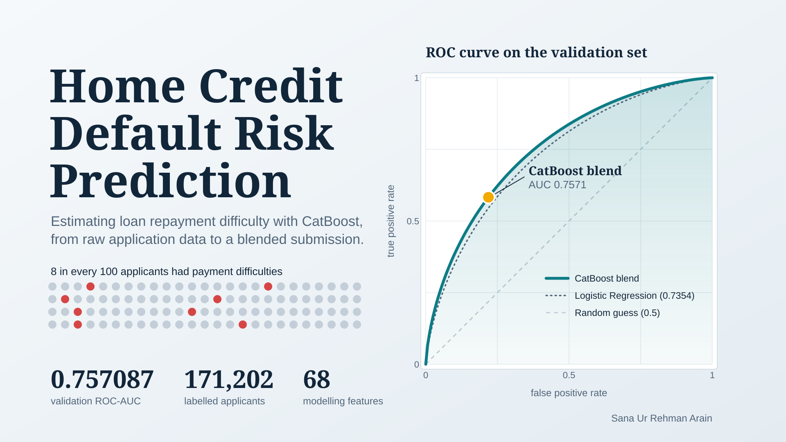
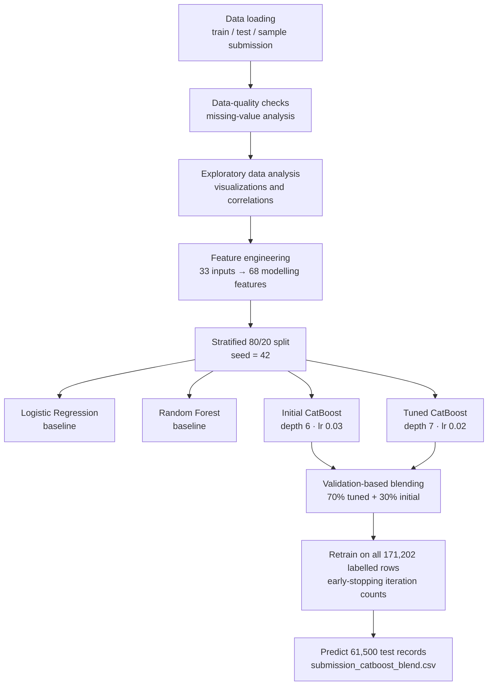
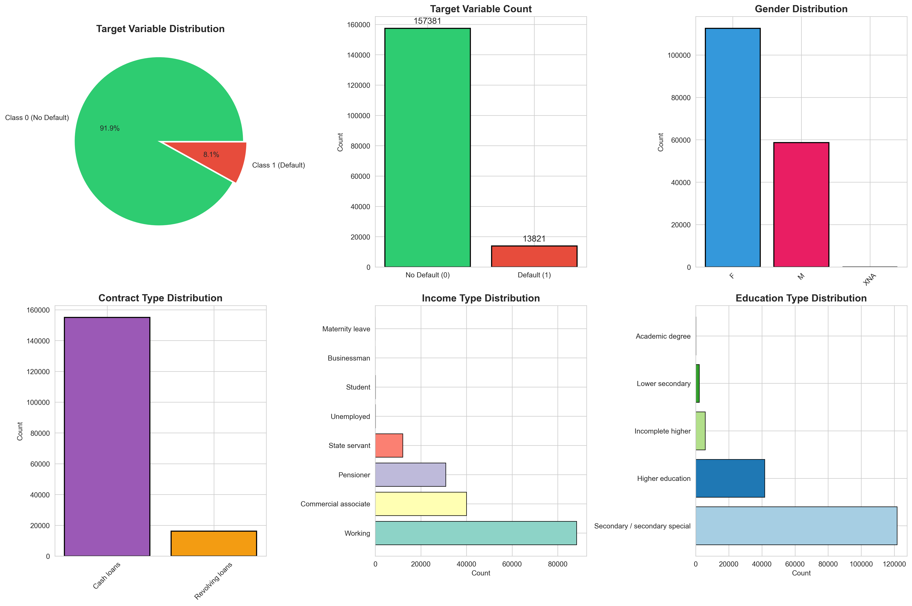
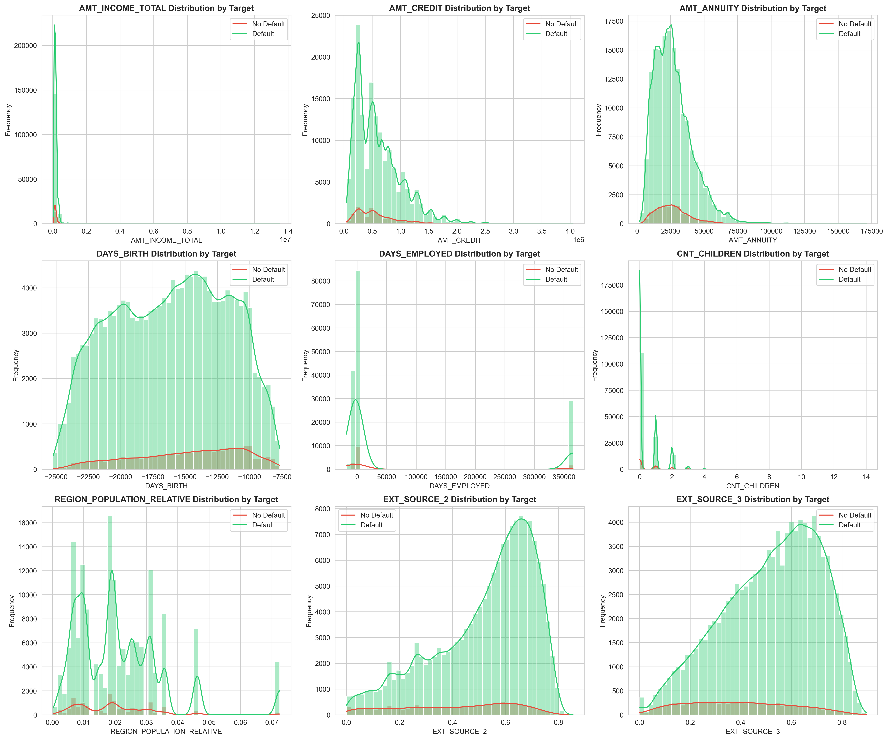
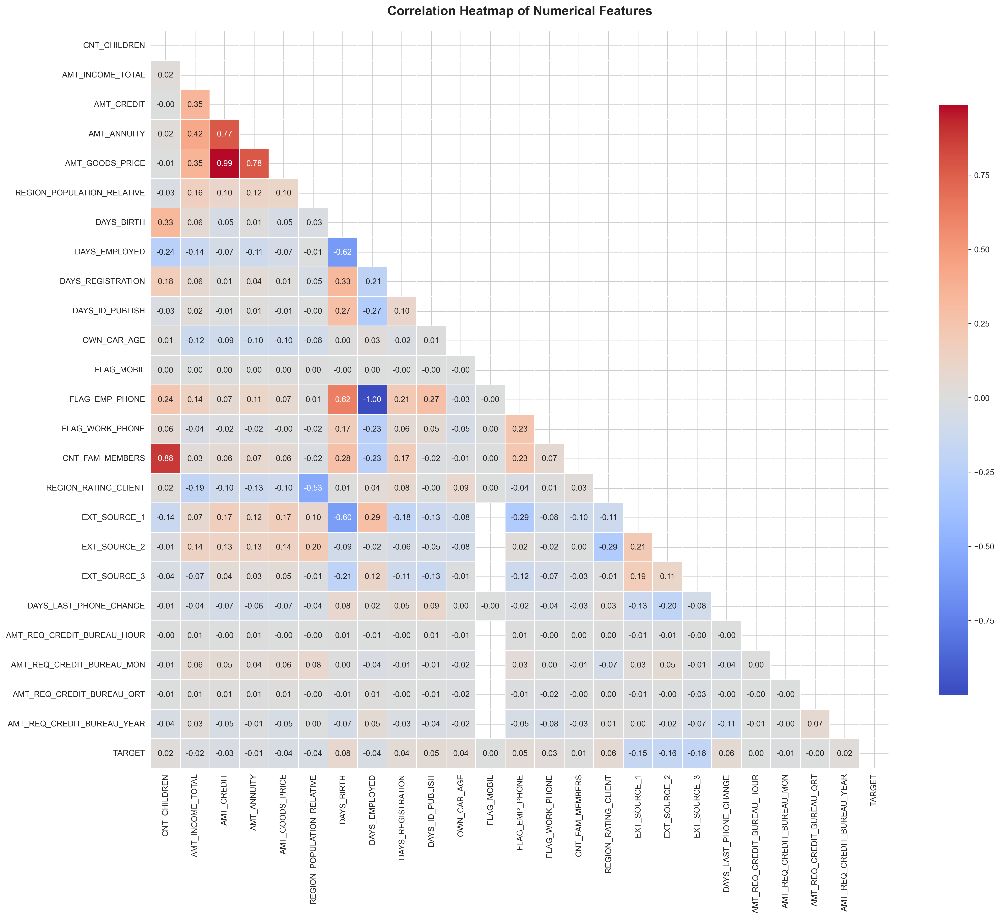
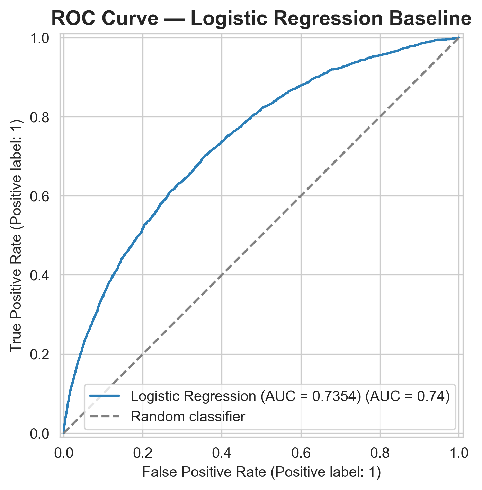
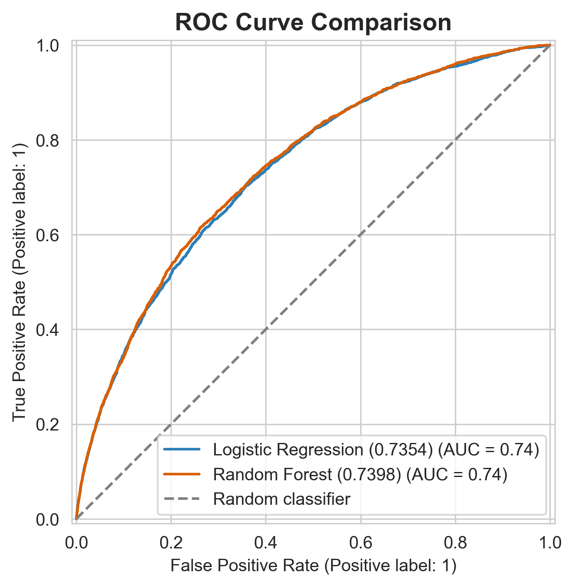
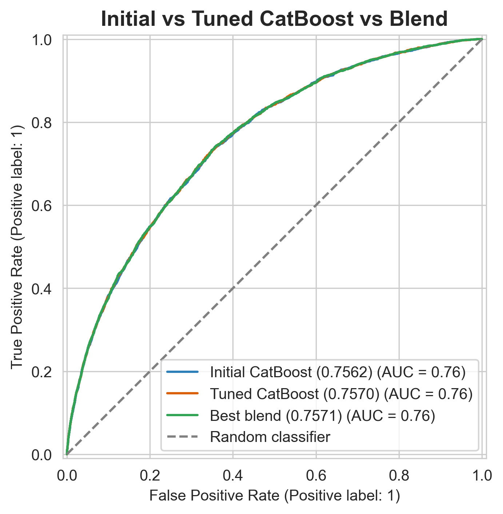
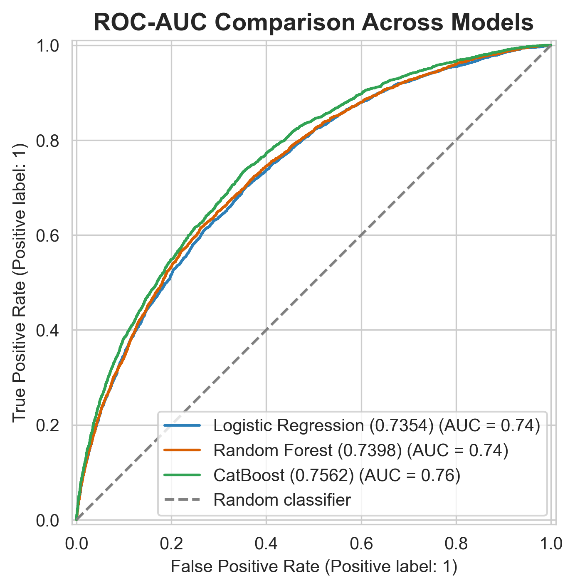
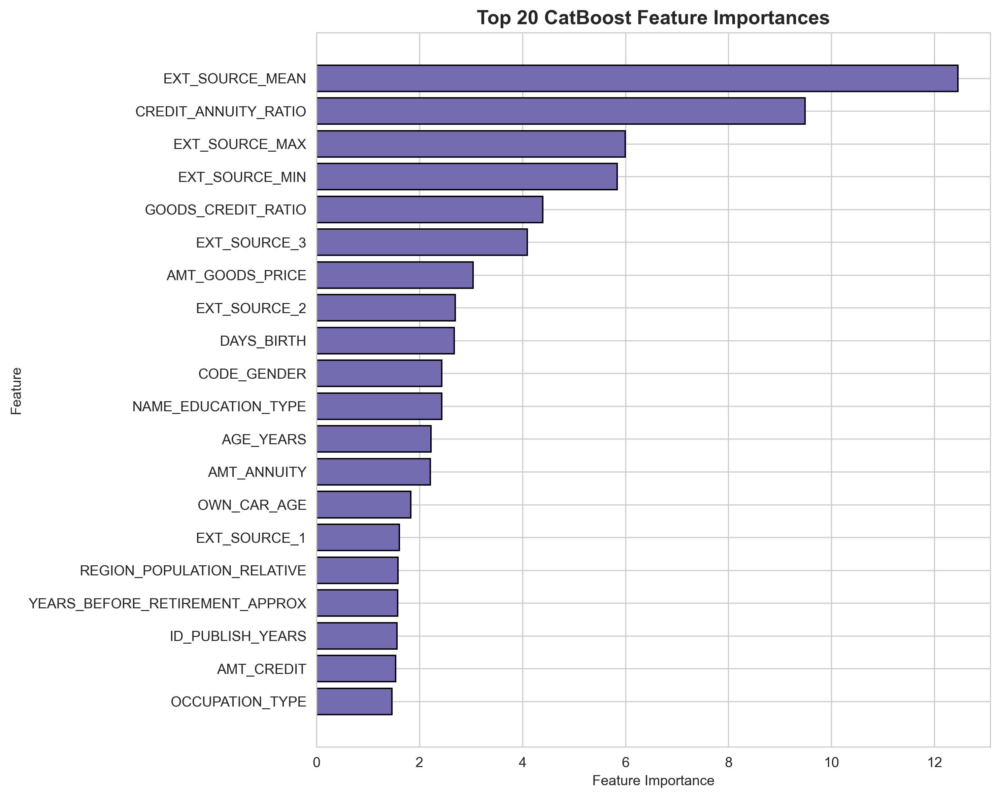

<div align="center">


# Home Credit Default Risk Prediction with CatBoost

### End-to-end credit-risk modelling · feature engineering · tuning · probability blending

> An end-to-end machine-learning project for predicting the probability that a loan applicant will experience payment difficulties. The project combines exploratory data analysis, feature engineering, baseline modelling, CatBoost gradient boosting, early stopping, and probability blending.


</div>

---

## Table of Contents

- [Project Overview](#project-overview)
- [Results at a Glance](#results-at-a-glance)
- [Business Objective](#business-objective)
- [Dataset](#dataset)
- [Project Workflow](#project-workflow)
- [Exploratory Data Analysis](#exploratory-data-analysis)
- [Feature Engineering](#feature-engineering)
- [Modelling Approach](#modelling-approach)
- [Results](#results)
- [Selected Final Model](#selected-final-model)
- [Submission Output](#submission-output)
- [Methodological Notes](#methodological-notes)
- [Project Structure](#project-structure)
- [Installation](#installation)
- [Requirements](#requirements)
- [Reproducibility](#reproducibility)
- [Key Findings](#key-findings)
- [Limitations and Future Work](#limitations-and-future-work)
- [Conclusion](#conclusion)
- [Copyright Notice & License](#-copyright-notice--license)
- [Citation](#-citation)

<details>
<summary><b>List of Figures</b></summary>

| Figure | Description |
|---:|---|
| 1 | Target and categorical feature distributions |
| 2 | Numerical feature distributions by target class |
| 3 | Correlation heatmap of numerical features |
| 4 | ROC curve — Logistic Regression baseline |
| 5 | ROC curve comparison — Logistic Regression vs Random Forest |
| 6 | Top 20 CatBoost feature importances |
| 7 | ROC-AUC comparison across all model families |
| 8 | Initial vs tuned CatBoost vs selected blend |

</details>

---

## Project Overview

This project predicts the probability of loan-payment difficulty using the provided Home Credit application data. It was developed as an end-to-end tabular machine-learning workflow in **Visual Studio Code** using Python.

The work goes beyond a basic baseline by using:

- All provided applicant features rather than a limited subset
- Exploratory data analysis and visualizations
- Missing-value analysis and missingness indicators
- Domain-inspired financial and demographic feature engineering
- Logistic Regression and Random Forest benchmarks
- CatBoost models with native categorical-feature handling
- Validation-based early stopping
- A weighted probability blend of two CatBoost models
- A final submission CSV in the required competition format

The final selected approach achieved a holdout validation ROC-AUC of **0.757087**.

---

## Results at a Glance

| | |
|---|---|
| **Task** | Binary classification — probability of payment difficulty |
| **Metric** | ROC-AUC (threshold-independent ranking quality) |
| **Training data** | 171,202 labelled applicants (8.07% positive class) |
| **Test data** | 61,500 unlabelled applicants |
| **Modelling features** | 68 (32 original + 36 engineered) |
| **Best single model** | Tuned CatBoost — validation ROC-AUC **0.756991** |
| **Final model** | 70% Tuned CatBoost + 30% Initial CatBoost — validation ROC-AUC **0.757087** |
| **Lift over Logistic Regression baseline** | **+0.021721** ROC-AUC |

**Validation ROC-AUC by model**

```text
Logistic Regression  0.735366  ███████████████████████████████████████████████
Random Forest        0.739844  ████████████████████████████████████████████████
Initial CatBoost     0.756244  ███████████████████████████████████████████████████
Tuned CatBoost       0.756991  ███████████████████████████████████████████████████
CatBoost Blend       0.757087  ███████████████████████████████████████████████████  ← final
(bar length = (AUC − 0.50) × 200, i.e. measured from the random-classifier baseline)
```

---

## Business Objective

Financial institutions need to estimate the risk that a borrower will experience repayment difficulties. A reliable default-risk model can support:

- More consistent lending decisions
- Risk-aware credit pricing
- Early identification of high-risk applications
- Efficient allocation of manual credit-review resources

The model outputs a value between `0` and `1`, where a larger value indicates a higher estimated probability of payment difficulty.

---

## Dataset

The project uses the provided subset of the **Home Credit Default Risk** data.

| Dataset | Rows | Columns | Purpose |
|---|---:|---:|---|
| `train.csv` | 171,202 | 34 | Model development; includes the target variable |
| `test.csv` | 61,500 | 33 | Final prediction data; target is unknown |
| `sample_submission.csv` | 61,500 | 2 | Required submission schema |

### Target Variable

| Target value | Meaning |
|---:|---|
| `0` | No payment difficulty |
| `1` | Payment difficulty / default event |

The target distribution was imbalanced:

| Class | Count | Percentage |
|---|---:|---:|
| No payment difficulty (`0`) | 157,381 | 91.93% |
| Payment difficulty (`1`) | 13,821 | 8.07% |

The imbalance ratio is approximately **11.39 : 1** (negative to positive).

Because of this imbalance, **ROC-AUC** was used as the principal evaluation metric. ROC-AUC evaluates how well the model ranks default-risk probabilities independently of any one classification threshold.

> **Note:** *Make sure to unzip the input folder correctly. Before running the notebook, ensure that all the data inside the folder is placed in the `Project_root/input/` directory, which is the path the notebook reads from.*

### Feature Dictionary (Original Inputs)

The 33 original columns (32 predictors plus the `SK_ID_CURR` identifier) fall into the following groups.

| Group | Columns |
|---|---|
| **Identifier** | `SK_ID_CURR` *(excluded from modelling)* |
| **Loan characteristics** | `NAME_CONTRACT_TYPE`, `AMT_CREDIT`, `AMT_ANNUITY`, `AMT_GOODS_PRICE` |
| **Applicant demographics** | `CODE_GENDER`, `CNT_CHILDREN`, `CNT_FAM_MEMBERS`, `NAME_FAMILY_STATUS`, `NAME_EDUCATION_TYPE`, `DAYS_BIRTH` |
| **Income and employment** | `AMT_INCOME_TOTAL`, `NAME_INCOME_TYPE`, `OCCUPATION_TYPE`, `ORGANIZATION_TYPE`, `DAYS_EMPLOYED` |
| **Housing, assets, and region** | `NAME_HOUSING_TYPE`, `OWN_CAR_AGE`, `REGION_POPULATION_RELATIVE`, `REGION_RATING_CLIENT` |
| **Documents and contact** | `DAYS_REGISTRATION`, `DAYS_ID_PUBLISH`, `DAYS_LAST_PHONE_CHANGE`, `FLAG_MOBIL`, `FLAG_EMP_PHONE`, `FLAG_WORK_PHONE` |
| **External risk scores** | `EXT_SOURCE_1`, `EXT_SOURCE_2`, `EXT_SOURCE_3` |
| **Credit-bureau enquiries** | `AMT_REQ_CREDIT_BUREAU_HOUR`, `_MON`, `_QRT`, `_YEAR` |
| **Target** | `TARGET` *(training data only)* |

Eight predictors are categorical (`NAME_CONTRACT_TYPE`, `CODE_GENDER`, `NAME_INCOME_TYPE`, `NAME_EDUCATION_TYPE`, `NAME_FAMILY_STATUS`, `NAME_HOUSING_TYPE`, `OCCUPATION_TYPE`, `ORGANIZATION_TYPE`); the remainder are numerical.

---

## Project Workflow

```text
Data loading
    ↓
Data-quality checks and missing-value analysis
    ↓
Exploratory data analysis and visualizations
    ↓
Feature engineering
    ↓
Stratified train-validation split
    ↓
Baseline models: Logistic Regression and Random Forest
    ↓
CatBoost modelling with early stopping
    ↓
Hyperparameter tuning
    ↓
Validation-based probability blending
    ↓
Final training on all labelled data
    ↓
Test-set predictions and submission CSV generation
```

The same workflow as a diagram:



---

## Exploratory Data Analysis

### Data Quality Overview

- The training set has **171,202** rows and **34** columns; the test set has **61,500** rows and **33** columns.
- Column types in the training data: 16 `float64`, 10 `int64`, and 8 `object` (categorical).
- Only nine training columns contain missing values (see [Missing Values](#missing-values)).
- Training and test missingness rates are closely matched, which suggests no obvious distribution shift in data availability.

| Variable | Mean | Median | Max | Observation |
|---|---:|---:|---:|---|
| `AMT_INCOME_TOTAL` | 168,371 | 146,250 | 13,500,000 | Strong right skew with extreme high-income outliers |
| `AMT_CREDIT` | 599,129 | 514,602 | 4,050,000 | Right-skewed loan amounts |
| `AMT_ANNUITY` | 27,120 | 24,917 | 170,987 | Right-skewed repayment amounts |
| `CNT_CHILDREN` | 0.42 | 0 | 14 | Most applicants have no children |
| `AMT_REQ_CREDIT_BUREAU_QRT` | 0.27 | 0 | 261 | Extreme outlier relative to the 75th percentile (0) |
| `EXT_SOURCE_1` | 0.502 | 0.506 | 0.948 | Scores are bounded between 0 and 1 |
| `EXT_SOURCE_2` | 0.515 | 0.566 | 0.855 | Left-skewed |
| `EXT_SOURCE_3` | 0.511 | 0.537 | 0.896 | Broad, roughly symmetric spread |

Additional data-quality observations:

- `DAYS_BIRTH` ranges from −25,229 to −7,673 days, which corresponds to applicant ages of roughly **21 to 69 years**.
- `DAYS_EMPLOYED` has a maximum of **365,243**, a known placeholder rather than a genuine employment duration. This is handled explicitly in the feature engineering.

### Target Distribution

The dataset has a substantial class imbalance: only 8.07% of applicants belong to the default/payment-difficulty class. Therefore, accuracy alone would be misleading, because a naïve model predicting only class `0` would already appear highly accurate.

<p align="center">
  
</p>

<p align="center"><em>Figure 1. Target distribution and distributions of selected categorical variables, including gender, contract type, income type, and education type.</em></p>

Key observations from the categorical distributions:

- **Gender:** female applicants outnumber male applicants, with a negligible number of `XNA` records.
- **Contract type:** cash loans account for the large majority of applications; revolving loans are a small minority.
- **Income type:** `Working` is the largest group, followed by `Commercial associate`, `Pensioner`, and `State servant`. Several categories (for example `Student`, `Unemployed`, `Businessman`, `Maternity leave`) are extremely rare.
- **Education:** `Secondary / secondary special` dominates, followed by `Higher education`.

### Numerical Feature Distributions

Numerical features were inspected by target class. Financial amount variables were right-skewed, while several applicant and credit-history variables had distinctive distributions.

<p align="center">
  
</p>

<p align="center"><em>Figure 2. Distributions of selected numerical variables by target class, including income, credit amount, annuity, age-related variables, external scores, and regional population indicators.</em></p>

Notable patterns:

- `AMT_INCOME_TOTAL` is dominated by a very narrow range with a long right tail, motivating ratio features rather than raw amounts alone.
- `DAYS_EMPLOYED` shows a distinct spike at the `365243` placeholder value, separate from the genuine employment durations.
- `EXT_SOURCE_2` and `EXT_SOURCE_3` have broad distributions across the score range; the default class is a small share at every score level, so the separation they provide is subtle and best exploited by a model rather than by eye.

### Correlation Analysis

A numerical-feature correlation heatmap was used to identify relationships between variables. For example:

- `AMT_CREDIT` and `AMT_GOODS_PRICE` were strongly correlated.
- `AMT_CREDIT` and `AMT_ANNUITY` were also strongly related.
- The external-source variables showed meaningful relationships with the target.
- Correlation was used for exploration only; final feature selection relied on model validation and CatBoost feature importance.

<p align="center">
  
</p>

<p align="center"><em>Figure 3. Lower-triangle correlation heatmap for numerical features.</em></p>

**Strongest relationships between raw features (approximate, read from the heatmap)**

| Feature pair | Correlation | Interpretation |
|---|---:|---|
| `AMT_CREDIT` ↔ `AMT_GOODS_PRICE` | ≈ 0.99 | Credit amount closely follows goods price |
| `DAYS_EMPLOYED` ↔ `FLAG_EMP_PHONE` | ≈ −1.00 | Both are driven by the `365243` placeholder group |
| `CNT_CHILDREN` ↔ `CNT_FAM_MEMBERS` | ≈ 0.88 | Household-size redundancy |
| `AMT_ANNUITY` ↔ `AMT_GOODS_PRICE` | ≈ 0.78 | Larger purchases imply larger repayments |
| `AMT_CREDIT` ↔ `AMT_ANNUITY` | ≈ 0.77 | Larger loans imply larger repayments |

**Top positive linear correlations with `TARGET`**

| Rank | Feature | Correlation with `TARGET` |
|---:|---|---:|
| 1 | `DAYS_BIRTH` | 0.079541 |
| 2 | `REGION_RATING_CLIENT` | 0.058984 |
| 3 | `DAYS_LAST_PHONE_CHANGE` | 0.055194 |
| 4 | `DAYS_ID_PUBLISH` | 0.052567 |
| 5 | `FLAG_EMP_PHONE` | 0.045646 |
| 6 | `DAYS_REGISTRATION` | 0.041669 |
| 7 | `OWN_CAR_AGE` | 0.040035 |
| 8 | `FLAG_WORK_PHONE` | 0.029102 |
| 9 | `AMT_REQ_CREDIT_BUREAU_YEAR` | 0.019691 |
| 10 | `CNT_CHILDREN` | 0.018034 |

All individual linear correlations with the target are weak (below 0.08 in magnitude). This is typical for credit-risk data and is the main reason nonlinear, interaction-aware models such as CatBoost were expected to outperform linear baselines. The three `EXT_SOURCE` variables show the most visible *negative* correlation with the target in the heatmap: higher external scores correspond to a lower likelihood of payment difficulty.

### Missing Values

Important missing-value patterns were identified:

| Feature | Missing percentage in training data |
|---|---:|
| `EXT_SOURCE_1` | 69.47% |
| `OWN_CAR_AGE` | 66.00% |
| `EXT_SOURCE_3` | 31.88% |
| Credit-bureau enquiry fields | 13.50% each |
| `EXT_SOURCE_2` | 0.22% |

Rather than simply dropping incomplete columns, the modelling workflow retained useful variables, created missingness indicators, and allowed CatBoost to handle numerical missing values natively.

<details>
<summary><b>Detailed missing-value comparison: train vs test</b></summary>

| Feature | Train missing count | Train % | Test missing count | Test % |
|---|---:|---:|---:|---:|
| `EXT_SOURCE_1` | 118,928 | 69.47% | 42,912 | 69.78% |
| `OWN_CAR_AGE` | 112,992 | 66.00% | 40,909 | 66.52% |
| `EXT_SOURCE_3` | 54,586 | 31.88% | 19,690 | 32.02% |
| `AMT_REQ_CREDIT_BUREAU_HOUR` | 23,116 | 13.50% | 8,513 | 13.84% |
| `AMT_REQ_CREDIT_BUREAU_MON` | 23,116 | 13.50% | 8,513 | 13.84% |
| `AMT_REQ_CREDIT_BUREAU_QRT` | 23,116 | 13.50% | 8,513 | 13.84% |
| `AMT_REQ_CREDIT_BUREAU_YEAR` | 23,116 | 13.50% | 8,513 | 13.84% |
| `EXT_SOURCE_2` | 369 | 0.22% | 130 | 0.21% |
| `CNT_FAM_MEMBERS` | 2 | 0.00% | 0 | 0.00% |

The four credit-bureau enquiry fields share an identical missing count, indicating that they are missing together (the applicant has no bureau record) rather than independently.

</details>

---

## Feature Engineering

The original training dataset contained 33 input variables plus the target. The feature-engineering process expanded the training data to **68 modelling features**.

| | Count |
|---|---:|
| Original predictors (excluding `SK_ID_CURR` and `TARGET`) | 32 |
| Engineered features | 36 |
| **Total modelling features** | **68** |
| Numerical features | 60 |
| Categorical features | 8 |

### Time and Demographic Features

The following features converted negative day-count variables into interpretable year-based measures:

- `AGE_YEARS`
- `EMPLOYED_YEARS`
- `REGISTRATION_YEARS`
- `ID_PUBLISH_YEARS`
- `PHONE_CHANGE_YEARS`

A special placeholder value in `DAYS_EMPLOYED` (`365243`) was handled by:

- Replacing the value with missing data for employment-year calculations
- Creating `IS_UNEMPLOYED_PLACEHOLDER`

### Financial Ratio Features

Credit affordability and loan structure were represented with:

- `CREDIT_INCOME_RATIO`
- `ANNUITY_INCOME_RATIO`
- `CREDIT_ANNUITY_RATIO`
- `GOODS_CREDIT_RATIO`
- `INCOME_PER_FAMILY_MEMBER`
- `INCOME_PER_CHILD`
- `CREDIT_PER_FAMILY_MEMBER`

### Family and Employment Features

Additional features included:

- `CHILDREN_PER_FAMILY_MEMBER`
- `IS_PARENT`
- `IS_LARGE_FAMILY`
- `EMPLOYED_AGE_RATIO`
- `YEARS_BEFORE_RETIREMENT_APPROX`

### External-Score Aggregates

The three external-score variables were combined into robust aggregate features:

- `EXT_SOURCE_MEAN`
- `EXT_SOURCE_MIN`
- `EXT_SOURCE_MAX`
- `EXT_SOURCE_STD`
- `EXT_SOURCE_COUNT`

### Credit-Bureau and Contact Features

The project also added:

- `CREDIT_BUREAU_REQUEST_TOTAL`
- `CREDIT_BUREAU_REQUEST_AVG`
- `CREDIT_BUREAU_REQUEST_MISSING`
- `TOTAL_CONTACT_FLAGS`

### Missingness Indicators

Binary missing-value indicators were created for incomplete features. Missingness can itself contain predictive information, particularly in credit-risk data where the availability of financial or external-score information may be informative.

Eight indicators were generated from the training data: `OWN_CAR_AGE_MISSING`, `CNT_FAM_MEMBERS_MISSING`, `EXT_SOURCE_1_MISSING`, `EXT_SOURCE_2_MISSING`, `EXT_SOURCE_3_MISSING`, and one for each of the four `AMT_REQ_CREDIT_BUREAU_*` fields (the last four share identical patterns).

### Engineered Feature Catalogue

<details>
<summary><b>Expand the full feature catalogue with definitions and rationale</b></summary>

| Feature | Definition | Rationale |
|---|---|---|
| `AGE_YEARS` | `-DAYS_BIRTH / 365.25` | Human-readable age |
| `EMPLOYED_YEARS` | `-DAYS_EMPLOYED / 365.25` (placeholder → missing) | Employment tenure without the `365243` artefact |
| `REGISTRATION_YEARS` | `-DAYS_REGISTRATION / 365.25` | Stability of registration |
| `ID_PUBLISH_YEARS` | `-DAYS_ID_PUBLISH / 365.25` | Recency of identity-document change |
| `PHONE_CHANGE_YEARS` | `-DAYS_LAST_PHONE_CHANGE / 365.25` | Contact stability |
| `CREDIT_INCOME_RATIO` | `AMT_CREDIT / AMT_INCOME_TOTAL` | Loan size relative to earnings |
| `ANNUITY_INCOME_RATIO` | `AMT_ANNUITY / AMT_INCOME_TOTAL` | Repayment burden relative to income |
| `CREDIT_ANNUITY_RATIO` | `AMT_CREDIT / AMT_ANNUITY` | Implied loan term |
| `GOODS_CREDIT_RATIO` | `AMT_GOODS_PRICE / AMT_CREDIT` | Share of credit covering the goods purchased |
| `INCOME_PER_FAMILY_MEMBER` | `AMT_INCOME_TOTAL / CNT_FAM_MEMBERS` | Per-capita household income |
| `INCOME_PER_CHILD` | `AMT_INCOME_TOTAL / (CNT_CHILDREN + 1)` | Income adjusted for dependants |
| `CREDIT_PER_FAMILY_MEMBER` | `AMT_CREDIT / CNT_FAM_MEMBERS` | Credit burden per household member |
| `CHILDREN_PER_FAMILY_MEMBER` | `CNT_CHILDREN / CNT_FAM_MEMBERS` | Dependant share of household |
| `IS_PARENT` | `CNT_CHILDREN > 0` | Parental-status flag |
| `IS_LARGE_FAMILY` | `CNT_FAM_MEMBERS >= 4` | Large-household flag |
| `EMPLOYED_AGE_RATIO` | `EMPLOYED_YEARS / AGE_YEARS` | Share of life in employment |
| `YEARS_BEFORE_RETIREMENT_APPROX` | `AGE_YEARS - EMPLOYED_YEARS` | Approximate career-stage proxy |
| `IS_UNEMPLOYED_PLACEHOLDER` | `DAYS_EMPLOYED == 365243` | Flags the placeholder group explicitly |
| `EXT_SOURCE_MEAN / MIN / MAX / STD` | Row-wise statistics over the three external scores | Robust summary of external risk signals |
| `EXT_SOURCE_COUNT` | Number of non-missing external scores | Data-availability signal |
| `CREDIT_BUREAU_REQUEST_TOTAL` | Sum of the four bureau-enquiry counts | Overall enquiry activity |
| `CREDIT_BUREAU_REQUEST_AVG` | Mean of the four bureau-enquiry counts | Average enquiry intensity |
| `CREDIT_BUREAU_REQUEST_MISSING` | All four bureau fields missing | No-bureau-record flag |
| `TOTAL_CONTACT_FLAGS` | Sum of `FLAG_MOBIL`, `FLAG_EMP_PHONE`, `FLAG_WORK_PHONE` | Contactability summary |
| `*_MISSING` (8 indicators) | Column is missing → 1 | Missingness as a signal |

Division-by-zero cases were mapped to missing values, and any resulting infinities were replaced with `NaN` (zero infinite values remained after processing).

</details>

---

## Modelling Approach

### Validation Strategy

A stratified holdout split was used:

- Training partition: 80%
- Validation partition: 20%
- Random seed: `42`
- Stratification variable: `TARGET`

The target distribution remained consistent in both sets:

| Dataset partition | Class 0 | Class 1 |
|---|---:|---:|
| Training set | 91.93% | 8.07% |
| Validation set | 91.93% | 8.07% |

| Partition | Rows | Features |
|---|---:|---:|
| Training | 136,961 | 68 |
| Validation | 34,241 | 68 |
| Test (unlabelled) | 61,500 | 68 |

### Baseline 1: Logistic Regression

Logistic Regression was used as an interpretable baseline.

Preprocessing included:

- Median imputation of numerical features
- Standardization of numerical values
- Most-frequent imputation for categorical variables
- One-hot encoding for categorical variables
- Balanced class weights

Configuration: `solver="saga"`, `C=1.0`, `max_iter=2000`, `class_weight="balanced"`, `random_state=42`.

### Baseline 2: Random Forest

A Random Forest classifier was trained to capture nonlinear relationships.

Key configuration:

- `n_estimators=300`
- `max_depth=12`
- `min_samples_leaf=10`
- `max_features="sqrt"`
- `class_weight="balanced_subsample"`

The Random Forest slightly improved validation ROC-AUC but showed substantial overfitting.

### Main Model: CatBoost

CatBoost was selected as the primary approach because it can:

- Handle categorical variables directly
- Handle numerical missing values natively
- Learn nonlinear relationships and feature interactions
- Work effectively on structured tabular data

Two CatBoost configurations were tested with validation-based early stopping.

#### Initial CatBoost

| Hyperparameter | Value |
|---|---:|
| Iterations | 1,500 maximum |
| Learning rate | 0.03 |
| Depth | 6 |
| L2 regularization | 5 |
| Random strength | 1.0 |
| Early stopping rounds | 150 |
| Best iteration | 1,063 |

#### Tuned CatBoost

| Hyperparameter | Value |
|---|---:|
| Iterations | 2,500 maximum |
| Learning rate | 0.02 |
| Depth | 7 |
| L2 regularization | 8 |
| Random strength | 0.5 |
| Early stopping rounds | 200 |
| Best iteration | 1,822 |

#### Configuration Comparison

| Setting | Initial CatBoost | Tuned CatBoost |
|---|---:|---:|
| Loss function | Logloss | Logloss |
| Monitored metric | AUC | AUC |
| Max iterations | 1,500 | 2,500 |
| Learning rate | 0.03 | 0.02 |
| Depth | 6 | 7 |
| L2 leaf regularization | 5 | 8 |
| Random strength | 1.0 | 0.5 |
| Border count | 128 | 128 |
| Early stopping rounds | 150 | 200 |
| Categorical features | 8 (native handling) | 8 (native handling) |
| Random seed | 42 | 42 |
| Best iteration | 1,063 | 1,822 |
| Approx. training time (validation run) | ≈ 3 min 49 s | ≈ 7 min 53 s |

The tuned configuration trades a lower learning rate for deeper trees and stronger L2 regularization, which allows it to keep improving for longer before the overfitting detector stops training.

#### Validation AUC During Training

| Iteration | Initial CatBoost | Tuned CatBoost |
|---:|---:|---:|
| 0 | 0.6396 | 0.6648 |
| 100 | 0.7379 | 0.7390 |
| 200 | 0.7461 | 0.7462 |
| 300 | 0.7496 | 0.7500 |
| 500 | 0.7537 | 0.7534 |
| 1,000 | 0.7560 | 0.7558 |
| 1,500 | stopped at 1,063 | 0.7567 |
| **Best** | **0.7562** (iter. 1,063) | **0.7570** (iter. 1,822) |

### Probability Blending

The final approach blended the two CatBoost probability predictions:

$$
P_{\text{final}} = 0.70 \times P_{\text{tuned}} + 0.30 \times P_{\text{initial}}
$$

The blend was selected after testing several candidate weights on the validation set.

| Tuned weight | Initial weight | Validation ROC-AUC |
|---:|---:|---:|
| **0.7** | **0.3** | **0.757087** |
| 0.9 | 0.1 | 0.757060 |
| 0.5 | 0.5 | 0.757001 |
| 1.0 | 0.0 | 0.756991 |
| 0.3 | 0.7 | 0.756799 |

The weight sweep is very flat (a range of only about 0.0003 ROC-AUC), so the result is not sensitive to the exact weighting. The blend is best viewed as a small stability gain from averaging two differently configured models.

---

## Results

### Model Comparison

| Model | Training ROC-AUC | Validation ROC-AUC | Overfitting Gap |
|---|---:|---:|---:|
| Logistic Regression | 0.744525 | 0.735366 | 0.009159 |
| Random Forest | 0.866864 | 0.739844 | 0.127019 |
| Initial CatBoost | 0.798679 | 0.756244 | 0.042435 |
| Tuned CatBoost | 0.822396 | 0.756991 | 0.065404 |
| **CatBoost blend: 70% tuned + 30% initial** | — | **0.757087** | — |

The final blend achieved the strongest validation ROC-AUC. Although the gain over the tuned CatBoost model was small, it was positive and chosen based on validation performance.

**Improvement over the baselines (validation ROC-AUC)**

| Comparison | Absolute gain |
|---|---:|
| Random Forest vs Logistic Regression | +0.004478 |
| Initial CatBoost vs Random Forest | +0.016400 |
| Tuned CatBoost vs Initial CatBoost | +0.000748 |
| Blend vs Tuned CatBoost | +0.000095 |
| **Blend vs Logistic Regression (total)** | **+0.021721** |

### ROC Curve Comparison

<p align="center">
  
</p>

<p align="center"><em>Figure 4. ROC curve of the Logistic Regression baseline (validation AUC = 0.7354).</em></p>

<p align="center">
  
</p>

<p align="center"><em>Figure 5. ROC curve comparison of Logistic Regression and Random Forest models.</em></p>

<p align="center">
  
</p>

<p align="center"><em>Figure 8. ROC curve comparison of the initial CatBoost model, tuned CatBoost model, and selected probability blend. The three curves are nearly indistinguishable, reflecting the very small AUC differences between them.</em></p>

<p align="center">
  
</p>

<p align="center"><em>Figure 7. ROC-AUC comparison across Logistic Regression, Random Forest, and CatBoost. CatBoost separates clearly from the two baselines across most of the false-positive-rate range.</em></p>

### Baseline Classification Diagnostics

Threshold-based metrics are secondary to ROC-AUC for this task, but the Logistic Regression baseline (with balanced class weights) provides a useful illustration of the precision–recall trade-off at a `0.50` threshold.

| Class | Precision | Recall | F1-score | Support |
|---|---:|---:|---:|---:|
| 0 — No payment difficulty | 0.9571 | 0.6839 | 0.7978 | 31,477 |
| 1 — Payment difficulty | 0.1531 | 0.6509 | 0.2479 | 2,764 |
| Accuracy | | | 0.6813 | 34,241 |
| Macro average | 0.5551 | 0.6674 | 0.5229 | 34,241 |
| Weighted average | 0.8922 | 0.6813 | 0.7534 | 34,241 |

**Confusion matrix at threshold = 0.50**

| | Predicted: No difficulty | Predicted: Difficulty |
|---|---:|---:|
| **Actual: No difficulty** | 21,528 (true negatives) | 9,949 (false positives) |
| **Actual: Difficulty** | 965 (false negatives) | 1,799 (true positives) |

At this threshold the baseline catches about **65%** of true defaulters, at the cost of flagging many non-defaulters. In production, the decision threshold would be set according to the lender's relative cost of missed defaults versus rejected good customers; this is exactly why a threshold-independent metric such as ROC-AUC was used for model selection.

### CatBoost Feature Importance

CatBoost feature importance highlighted the predictive contribution of external-score aggregates and loan affordability variables.

| Rank | Feature | Importance |
|---:|---|---:|
| 1 | `EXT_SOURCE_MEAN` | 12.459503 |
| 2 | `CREDIT_ANNUITY_RATIO` | 9.488484 |
| 3 | `EXT_SOURCE_MAX` | 5.996096 |
| 4 | `EXT_SOURCE_MIN` | 5.837264 |
| 5 | `GOODS_CREDIT_RATIO` | 4.392235 |
| 6 | `EXT_SOURCE_3` | 4.095448 |
| 7 | `AMT_GOODS_PRICE` | 3.044058 |
| 8 | `EXT_SOURCE_2` | 2.695213 |
| 9 | `DAYS_BIRTH` | 2.676958 |
| 10 | `CODE_GENDER` | 2.436456 |

<p align="center">
  
</p>

<p align="center"><em>Figure 6. Top 20 CatBoost feature importances from the initial CatBoost model.</em></p>

<details>
<summary><b>Full top-20 feature importance table</b></summary>

| Rank | Feature | Importance | Type |
|---:|---|---:|---|
| 1 | `EXT_SOURCE_MEAN` | 12.459503 | Engineered |
| 2 | `CREDIT_ANNUITY_RATIO` | 9.488484 | Engineered |
| 3 | `EXT_SOURCE_MAX` | 5.996096 | Engineered |
| 4 | `EXT_SOURCE_MIN` | 5.837264 | Engineered |
| 5 | `GOODS_CREDIT_RATIO` | 4.392235 | Engineered |
| 6 | `EXT_SOURCE_3` | 4.095448 | Original |
| 7 | `AMT_GOODS_PRICE` | 3.044058 | Original |
| 8 | `EXT_SOURCE_2` | 2.695213 | Original |
| 9 | `DAYS_BIRTH` | 2.676958 | Original |
| 10 | `CODE_GENDER` | 2.436456 | Original |
| 11 | `NAME_EDUCATION_TYPE` | 2.433766 | Original |
| 12 | `AGE_YEARS` | 2.223299 | Engineered |
| 13 | `AMT_ANNUITY` | 2.211751 | Original |
| 14 | `OWN_CAR_AGE` | 1.832768 | Original |
| 15 | `EXT_SOURCE_1` | 1.610096 | Original |
| 16 | `REGION_POPULATION_RELATIVE` | 1.582672 | Original |
| 17 | `YEARS_BEFORE_RETIREMENT_APPROX` | 1.578700 | Engineered |
| 18 | `ID_PUBLISH_YEARS` | 1.565601 | Engineered |
| 19 | `AMT_CREDIT` | 1.538186 | Original |
| 20 | `OCCUPATION_TYPE` | 1.463485 | Original |

Five of the top ten features and eight of the top twenty are engineered features. The top five features alone (all engineered) account for roughly **38%** of total importance.

</details>

---

## Selected Final Model

The selected final model is a weighted blend:

```text
70% Tuned CatBoost + 30% Initial CatBoost
```

The two models were retrained on all **171,202 labelled training records** using their early-stopping-selected iteration counts:

| Final model | Training rows | Iterations |
|---|---:|---:|
| Initial CatBoost | 171,202 | 1,064 |
| Tuned CatBoost | 171,202 | 1,823 |

Final test-set probabilities were generated for all **61,500** unlabelled records.

Iteration counts are `get_best_iteration() + 1`, because CatBoost's best-iteration index is zero-based. Retraining on the full labelled data used about 3 min 36 s (initial) and 7 min 54 s (tuned).

---

## Submission Output

The final submission file is:

```text
output/submission_catboost_blend.csv
```

Its structure matches the required format:

```text
SK_ID_CURR,TARGET
171202,0.030027
171203,0.199725
171204,0.148769
...
```

### Submission Validation Checks

| Check | Result |
|---|---|
| Number of rows | 61,500 |
| Required columns | `SK_ID_CURR`, `TARGET` |
| Missing predictions | 0 |
| Finite predictions | Yes |
| Prediction range | 0.002012 to 0.833046 |
| Mean predicted probability | 0.088252 |
| ID ordering preserved from sample submission | Yes |

### Prediction Distribution

| Statistic | Predicted default probability |
|---|---:|
| Count | 61,500 |
| Mean | 0.088252 |
| Standard deviation | 0.087185 |
| Minimum | 0.002012 |
| 25th percentile | 0.030631 |
| Median | 0.058750 |
| 75th percentile | 0.113166 |
| Maximum | 0.833046 |

The mean predicted probability (8.83%) is close to the observed training default rate (8.07%), which is a reasonable sanity check on the overall level of the predictions. The distribution is right-skewed: most applicants receive low risk estimates, with a thin tail of high-risk cases.

---

## Methodological Notes

These notes describe how the evaluation should be interpreted.

- **Single holdout validation.** All reported ROC-AUC values come from one stratified 80/20 split. Differences of the order of 0.0001–0.001 (for example, blend vs tuned CatBoost) are within the range that could change under a different split and should be read as small rather than conclusive gains.
- **Validation set reused for selection.** The same validation set was used for early stopping, model choice, and blend-weight selection. The reported 0.757087 is therefore a mildly optimistic estimate of unseen-data performance; cross-validation would give a more conservative figure.
- **No preprocessing leakage in baselines.** Imputers, scalers, and encoders for Logistic Regression and Random Forest were fitted inside scikit-learn `Pipeline` objects, so they learn only from training data. Engineered features are row-wise transformations and do not use cross-row statistics or the target.
- **CatBoost categorical handling.** Categorical missing values were filled with the string `"MISSING"` and passed to CatBoost through its native categorical-feature mechanism; numerical missing values were left as `NaN`.
- **Train–test feature alignment.** One feature, `CNT_FAM_MEMBERS_MISSING`, exists only in the training data (the test data has no missing `CNT_FAM_MEMBERS`). It was added to the test set as a constant `0`, and test columns were reordered to match training exactly, with assertions verifying alignment.
- **Boosting-library availability.** LightGBM and XGBoost were confirmed to be installed in the environment, but only CatBoost was benchmarked in this project (see [Limitations and Future Work](#limitations-and-future-work)).
- **Identifier excluded.** `SK_ID_CURR` was removed from the feature matrix to avoid leaking row-order information.

---

## Project Structure

```text
home-credit-default-risk-catboost/
│
├── README.md
├── requirements.txt
├── .gitignore
├── CITATION.cff
├── LICENSE
├── input.zip
│   └── test.csv
│   └── train.csv
│
├── input/                       # Local competition files read by the notebook
│   ├── train.csv
│   ├── test.csv
│   └── sample_submission.csv
│
├── notebooks/
│   └── home_credit_default_risk_catboost.ipynb
│
├── figures/
│   ├── eda_categorical_features.png
│   ├── eda_numerical_features.png
│   ├── correlation_heatmap.png
│   ├── roc_curve_logistic_regression.png
│   ├── roc_curve_model_comparison.png
│   ├── roc_curve_all_models.png
│   ├── catboost_feature_importance.png
│   └── roc_curve_catboost_blend.png
│
├── output/
│   └── submission_catboost_blend.csv
│
└── data/
    └── HomeCredit_columns_description.xlsx
```

---

## Installation

### 1. Clone the repository

```bash
git clone https://github.com/sanaurrehmanarain/home-credit-default-risk-catboost.git
cd home-credit-default-risk-catboost
```

### 2. Create and activate a virtual environment

```bash
python -m venv .venv
```

Windows PowerShell:

```powershell
.\.venv\Scripts\Activate.ps1
```

macOS/Linux:

```bash
source .venv/bin/activate
```

### 3. Install dependencies

```bash
pip install -r requirements.txt
```

### 4. Add the competition files

Place the following files inside `input/` (the notebook reads `input/train.csv`, `input/test.csv`, and `input/sample_submission.csv`):

```text
train.csv
test.csv
sample_submission.csv
```

The column-description workbook belongs in `data/`:

```text
HomeCredit_columns_description.xlsx
```

### 5. Run the notebook

Open and run:

```text
notebooks/home_credit_default_risk_catboost.ipynb
```

Run all cells from top to bottom. The final cell creates:

```text
output/submission_catboost_blend.csv
```

> **Runtime note:** on a typical CPU, the two validation-stage CatBoost fits take roughly 4 and 8 minutes, and the two full-data retraining fits take a similar amount of time again, so plan for about 25 minutes of total training.

---

## Requirements

Create a `requirements.txt` file with:

```text
numpy
pandas
matplotlib
seaborn
scikit-learn
catboost
jupyter
ipykernel
```

For stronger reproducibility, record the exact package versions used in your environment:

```bash
pip freeze > requirements.txt
```

---

## Reproducibility

The workflow is designed to be reproducible:

- Fixed random seed: `42`
- Stratified train-validation split
- Explicit feature alignment between training and test data
- Explicit handling of the `DAYS_EMPLOYED = 365243` placeholder
- Deterministic CatBoost settings where supported by the local environment
- Saved final iteration counts selected through validation early stopping
- Submission schema checks before saving the CSV

To reproduce the final submission, run the notebook from the first cell through the final submission cell without skipping cells.

---

## Key Findings

1. **CatBoost outperformed the baseline models.**  
   It achieved a validation ROC-AUC of 0.756991 before blending, compared with 0.735366 for Logistic Regression and 0.739844 for Random Forest.

2. **The Random Forest overfit substantially.**  
   Its training ROC-AUC was 0.866864 while its validation ROC-AUC was 0.739844, producing an overfitting gap of 0.127019.

3. **External-source aggregate features were highly informative.**  
   `EXT_SOURCE_MEAN`, `EXT_SOURCE_MAX`, and `EXT_SOURCE_MIN` were among the strongest features.

4. **Loan affordability ratios were important.**  
   `CREDIT_ANNUITY_RATIO` and `GOODS_CREDIT_RATIO` were highly influential, suggesting that the loan structure and repayment burden contain predictive signal.

5. **Feature engineering improved the modelling representation.**  
   Age, employment, financial-ratio, household, external-score, contact, and credit-bureau features added interpretable structure to the original data.

6. **A small probability blend improved validation performance.**  
   The 70/30 CatBoost blend achieved the highest observed validation ROC-AUC of 0.757087.

7. **Individual raw features are weak linear predictors.**  
   No single raw feature has a linear correlation with the target above 0.08, so most of the predictive power comes from combinations of features, which gradient boosting captures well.

8. **Engineered features dominate the importance ranking.**  
   Five of the top five CatBoost features are engineered or engineered-aggregate features, underlining the value of domain-informed feature construction.

9. **Tuning produced diminishing returns.**  
   Moving from the initial to the tuned configuration added only +0.000748 ROC-AUC, suggesting the feature set rather than the hyperparameters is the main performance limiter.

---

## Limitations and Future Work

This project uses a single stratified holdout validation split. Future improvements could include:

- Stratified cross-validation or repeated holdout validation
- Out-of-fold predictions for a more robust blend
- Hyperparameter optimization using Optuna
- Comparison with LightGBM and XGBoost
- Calibration analysis using reliability curves and Brier score
- Investigation of fairness and bias across demographic groups
- More careful outlier treatment for high-income and high-credit applicants
- Additional feature interactions and target-encoding approaches evaluated strictly within cross-validation
- Model explainability with SHAP values

Further ideas worth exploring:

- **Auxiliary data sources.** The full Home Credit competition provides bureau, previous-application, installment, and credit-card tables; aggregating these would likely add substantial signal beyond the application table used here.
- **Threshold and cost analysis.** Convert probabilities to decisions using an explicit cost matrix for missed defaults versus rejected good customers.
- **Stacking.** Replace the fixed 70/30 average with a meta-learner trained on out-of-fold predictions.
- **Monitoring.** Track score drift and population stability before any real-world deployment.

---

## Conclusion

This project developed a complete credit default-risk prediction pipeline using the Home Credit application dataset. The workflow included data-quality checks, visual exploration, missing-value analysis, domain-informed feature engineering, baseline comparisons, CatBoost gradient boosting, early stopping, and model blending.

The final blended CatBoost model achieved a validation ROC-AUC of **0.757087** and generated valid probability predictions for all **61,500** test records. The project demonstrates a practical, reproducible approach to imbalanced binary classification and structured financial-risk modelling.

---

## ⚖️ Copyright Notice & License

© 2026 Sana Ur Rehman Arain.

This project is licensed under the **MIT License**. You are free to use, copy, modify, merge, publish, distribute, sublicense, and sell copies of this project, in whole or in part, provided that the copyright notice and license text are included in all copies or substantial portions of the project.

**Proper citation and attribution are required.** If you use, adapt, or build upon this work, you must give appropriate credit to the original author, **Sana Ur Rehman Arain**, and include a link back to the original repository where possible.

This project is provided **"as is"**, without warranty of any kind, express or implied, including but not limited to the warranties of merchantability, fitness for a particular purpose, and noninfringement.

For questions or permission requests, contact: **sana.arain.work@gmail.com**

See the [LICENSE](LICENSE) file for the complete license terms.

---

## 📖 Citation

If you use this project in academic research, publications, educational materials, or derivative works, please cite it and give appropriate credit to the original author.

> 💡 A [`CITATION.cff`](CITATION.cff) file is included, so GitHub shows a **"Cite this repository"** button in the sidebar with ready-made BibTeX, APA, and other formats.

### 📝 Suggested Citation

> Arain, S. U. R. (2026). *Home Credit Default Risk Prediction with CatBoost* (Version 1.0) [Software]. https://github.com/sanaurrehmanarain/home-credit-default-risk-catboost

### 📚 BibTeX

```bibtex
@software{arain2026creditrisk,
  author  = {Arain, Sana Ur Rehman},
  title   = {Home Credit Default Risk Prediction with CatBoost},
  year    = {2026},
  version = {1.0},
  url     = {https://github.com/sanaurrehmanarain/home-credit-default-risk-catboost}
}
```

### 👤 Author

<table>
  <tr>
    <td><b>Author</b></td>
    <td>Sana Ur Rehman Arain</td>
    <td rowspan="4" align="center" width="180">
      
    </td>
  </tr>
  <tr>
    <td><b>Role</b></td>
    <td>Data Scientist</td>
  </tr>
  <tr>
    <td><b>GitHub</b></td>
    <td><a href="https://github.com/sanaurrehmanarain">@sanaurrehmanarain</a></td>
  </tr>
  <tr>
    <td><b>Contact</b></td>
    <td><a href="mailto:sana.arain.work@gmail.com">sana.arain.work@gmail.com</a></td>
  </tr>
</table>

---

<p align="center"><em>⭐ If you found this repository helpful, consider giving it a star.</em></p>
